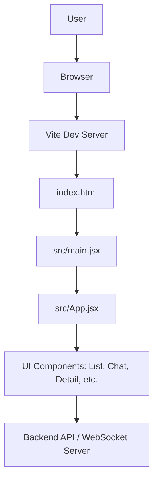

# Chit-Chat: A Modern Real-Time Messaging Application

## Project Overview

Chit-Chat is a modern, responsive, and high-performance real-time messaging application. Built with a robust front-end stack featuring **React**, **Vite**, and **Tailwind CSS**, it provides a seamless and intuitive user experience for instant communication. The project is optimized for a fast development workflow with Vite's Hot Module Replacement (HMR) and is configured for production-level code quality with ESLint.

### Key Features

*   **Modern Tech Stack:** Leverages the power of React for building a dynamic UI, Vite for an incredibly fast development experience, and Tailwind CSS for a utility-first styling workflow.
*   **Responsive Design:** The UI is designed to be fully responsive, providing a consistent experience across desktops, tablets, and mobile devices.
*   **Component-Based Architecture:** Follows a clean, modular structure, making the codebase easy to understand, maintain, and scale.
*   **Optimized Build Process:** Configured for efficient development builds and optimized production bundles.

## High-Level Architecture

The application follows a standard single-page application (SPA) architecture. The Vite development server serves the `index.html` file, which acts as the entry point. The main JavaScript module (`main.jsx`) then mounts the root React component (`App.jsx`), which renders the entire component tree and handles user interactions.



## Getting Started

Follow these instructions to get the project up and running on your local machine for development and testing purposes.

### Prerequisites

*   Node.js (v18.x or later recommended)
*   npm (v9.x or later) or an equivalent package manager like Yarn or pnpm.

### Installation & Setup

1.  **Clone the repository:**
    ```sh
    git clone https://github.com/your-username/chit-chat.git
    cd chit-chat
    ```

2.  **Install dependencies:**
    ```sh
    npm install
    ```

3.  **Run the development server:**
    ```sh
    npm run dev
    ```
    The application will be available at `http://localhost:5173` (or the next available port). The server supports Hot Module Replacement (HMR), so changes to the code will be reflected in the browser instantly.

4.  **Build for production:**
    ```sh
    npm run build
    ```
    This command generates a static, optimized build of the application in the `dist/` directory, which is ready to be deployed.

## Module Breakdown

This section provides a detailed overview of the key configuration files and directories in the project.

### Configuration Files

*   **`vite.config.js`**
    *   **Purpose:** The main configuration file for Vite.
    *   **Details:** It configures the build tool, sets up the development server, and integrates the official React plugin (`@vitejs/plugin-react`). This plugin enables React-specific features like Fast Refresh (HMR) and JSX transformation.

*   **`tailwind.config.js`**
    *   **Purpose:** Configures the Tailwind CSS framework.
    *   **Details:** The `content` array specifies the files that Tailwind should scan to find and generate the necessary utility classes. The `theme.extend` object can be used to customize the default design system (colors, spacing, fonts, etc.).

*   **`postcss.config.js`**
    *   **Purpose:** Configuration for PostCSS, a tool for transforming CSS with JavaScript plugins.
    *   **Details:** This file is essential for integrating Tailwind CSS and Autoprefixer. `tailwindcss` processes Tailwind directives and utility classes, while `autoprefixer` automatically adds vendor prefixes to CSS rules for better cross-browser compatibility.

*   **`eslint.config.js`**
    *   **Purpose:** Defines the linting rules for the project to ensure code quality and consistency.
    *   **Details:** It uses a modern flat config format. Key plugins include `eslint-plugin-react` for React-specific rules, `eslint-plugin-react-hooks` for enforcing the Rules of Hooks, and `eslint-plugin-react-refresh` to ensure components are correctly structured for Fast Refresh. The configuration ignores the `dist` build directory.

### Core Application Files

*   **`index.html`**
    *   **Purpose:** The single HTML entry point for the application.
    *   **Details:** This file contains the root DOM element (`<div id="root">`) where the React application is mounted. It also includes the script tag `<script type="module" src="/src/main.jsx">` that loads the main JavaScript bundle.

*   **`src/main.jsx`** (Inferred)
    *   **Purpose:** The primary entry point for the React application's JavaScript code.
    *   **Details:** This file is responsible for importing the root React component (`App.jsx`) and rendering it into the `#root` element in `index.html` using `ReactDOM.createRoot()`.

*   **`src/index.css`**
    *   **Purpose:** The global stylesheet entry point.
    *   **Details:** This file imports the three main Tailwind CSS layers: `base`, `components`, and `utilities`. Any project-wide global styles should be defined here.

*   **`src/App.css`**
    *   **Purpose:** Contains custom CSS specific to the main application layout and global elements.
    *   **Details:** This file defines custom styles that complement or override Tailwind CSS utilities. In this project, it is used for setting a global background image and implementing custom scrollbar styling across all browsers for a polished look and feel.
